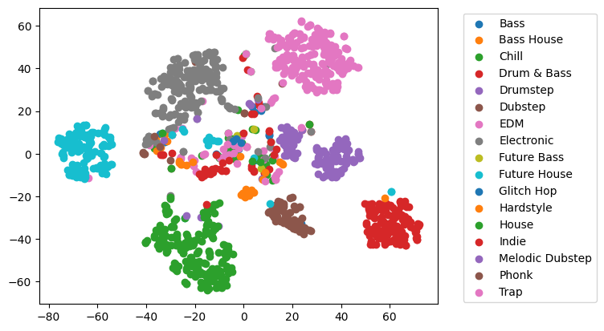

# Music Genre Prediction

Classify music genres with a convolutional neural network (CNN).
Mel-spectrograms and MFCCs are extracted from audio files downloaded through [https://github.com/kirtan-shah/NCSDownloader](https://github.com/kirtan-shah/NCSDownloader).

Latent space vectors are extracted from the forward classification pass for each audio snippet and visualized using the t-SNE method. Each point represents a distinct music snippet. Notice how snippets of same or similar genres tend to cluster together.
